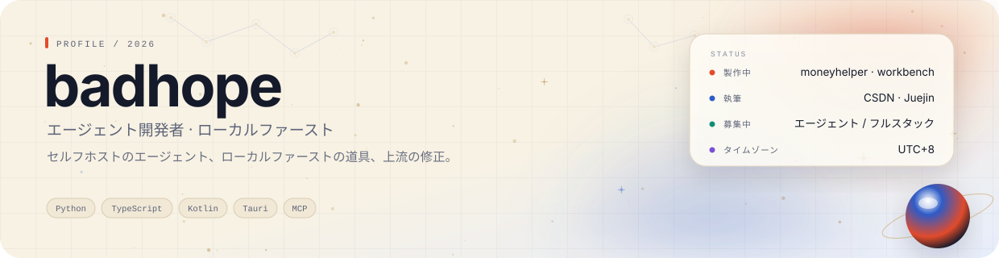
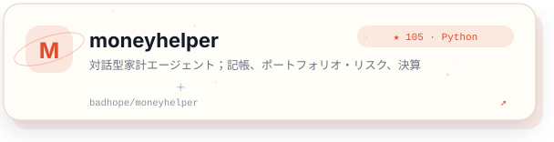
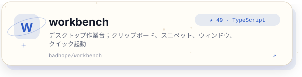
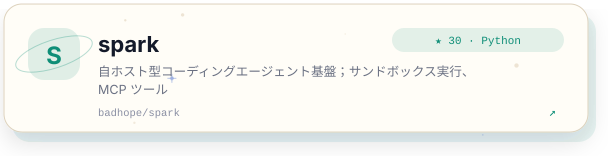
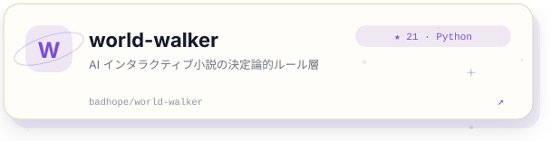
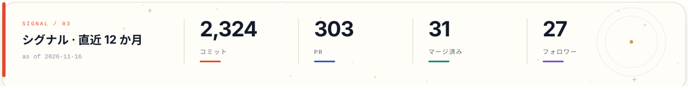

<a href="README.md">English</a> · <a href="README.zh-CN.md">中文</a> · <b>日本語</b>

<picture><source media="(prefers-color-scheme: dark)" srcset="assets/hero-ja-dark.svg" /></picture>

<picture><source media="(prefers-color-scheme: dark)" srcset="assets/starchart-ja-dark.svg" /></picture>

ゆっくり回る星図 · 一周一分

## 01 · いま

- **個人リポジトリ** — 27 件 · 個人名前空間、fork を除く
- **外部 PR** — 6 件：マージ 2、オープン 4、クローズ 0
- **配信** — CSDN 長文アーカイブ、Juejin・知乎・博客园 は自動運用

## 02 · 外部 PR

6 件 · マージ済み 2 · オープン 4 · クローズ 0 · +761/−89 · 16 ファイル · 15 コメント

マージ済み 2 件 · 平均 0.5 日 · 最速 0 日

- [davila7/claude-code-templates#1675](https://github.com/davila7/claude-code-templates/pull/1675) — Add release-manager agent (development-team) · **マージ済み** · マージ 2026-11-24 · +38/−0 · 1 ファイル · 6 コメント
- [Infisical/cli#517](https://github.com/Infisical/cli/pull/517) — fix(secrets): set expands NAME=@filepath with a token like it does with a login · **オープン** · 提出 2026-11-23 · +70/−16 · 2 ファイル · 1 コメント
- [dapr/dapr#11226](https://github.com/dapr/dapr/pull/11226) — feat(api): standardize workflow api errors with the rich error model · **オープン** · 提出 2026-11-23 · +446/−62 · 8 ファイル · 0 コメント
- [Infisical/cli#516](https://github.com/Infisical/cli/pull/516) — feat(export): add --quote-style to the dotenv export formats · **オープン** · 提出 2026-11-23 · +112/−8 · 3 ファイル · 1 コメント
- [kestra-io/kestra#23016](https://github.com/kestra-io/kestra/pull/23016) — docs(assets): fix devcontainer links and image paths in contributing guide · **マージ済み** · マージ 2026-11-23 · +3/−3 · 1 ファイル · 2 コメント
- [davila7/claude-code-templates#1673](https://github.com/davila7/claude-code-templates/pull/1673) — Add env-var-auditor skill (development) · **オープン** · 提出 2026-11-23 · +92/−0 · 1 ファイル · 5 コメント

PR スナップショット 2026-11-24 · GitHub Search / pulls API

## 03 · 代表プロジェクト

<a href="https://github.com/badhope/moneyhelper"><picture><source media="(prefers-color-scheme: dark)" srcset="assets/project-0-ja-dark.svg" /></picture></a> <a href="https://github.com/badhope/workbench"><picture><source media="(prefers-color-scheme: dark)" srcset="assets/project-1-ja-dark.svg" /></picture></a>

<a href="https://github.com/badhope/spark"><picture><source media="(prefers-color-scheme: dark)" srcset="assets/project-2-ja-dark.svg" /></picture></a> <a href="https://github.com/badhope/world-walker"><picture><source media="(prefers-color-scheme: dark)" srcset="assets/project-3-ja-dark.svg" /></picture></a>

<a href="https://github.com/badhope/sciflow"><picture><source media="(prefers-color-scheme: dark)" srcset="assets/project-4-ja-dark.svg" /></picture></a> <a href="https://github.com/badhope/harbor"><picture><source media="(prefers-color-scheme: dark)" srcset="assets/project-5-ja-dark.svg" /></picture></a>

その他のプロジェクト: [digilegacy](https://github.com/badhope/digilegacy) · [aquapilot](https://github.com/badhope/aquapilot)

## 04 · 数字

<picture><source media="(prefers-color-scheme: dark)" srcset="assets/numbers-ja-dark.svg" /></picture>

## 05 · コントリビューション

<picture><source media="(prefers-color-scheme: dark)" srcset="assets/contrib-ja-dark.svg" /></picture>

日々の寄与は GitHub GraphQL の正確なスナップショット · 毎週更新

## 06 · 言語構成

<picture><source media="(prefers-color-scheme: dark)" srcset="assets/langs-ja-dark.svg" /></picture>

## 07 · 配信ライン

<a href="https://blog.csdn.net/weixin_56622231"><picture><source media="(prefers-color-scheme: dark)" srcset="assets/channel-csdn-ja-dark.svg" /></picture></a> <a href="https://juejin.cn/user/2350111542479753/posts"><picture><source media="(prefers-color-scheme: dark)" srcset="assets/channel-juejin-ja-dark.svg" /></picture></a>

<a href="https://www.zhihu.com/people/e7c851hd"><picture><source media="(prefers-color-scheme: dark)" srcset="assets/channel-zhihu-ja-dark.svg" /></picture></a> <a href="https://www.cnblogs.com/badhope"><picture><source media="(prefers-color-scheme: dark)" srcset="assets/channel-cnblogs-ja-dark.svg" /></picture></a>

四つの配信アカウント。CSDN は手動アーカイブ、Juejin・知乎・博客园 は自動化ラインで運用。

CSDN 最新

- 2026-11-04 — [把 AI Agent 接进业务系统，我踩了 3 个挺蠢的坑](https://blog.csdn.net/weixin_56622231/article/details/170051167)
- 2026-10-18 — [Gemini 4 Argon 全面开放：谷歌憋了半年的旗舰大招，到底行不行？](https://blog.csdn.net/weixin_56622231/article/details/168251657)

<a href="https://blog.csdn.net/weixin_56622231">CSDN の全記事 →</a>

One source, five profiles · numbers from a local snapshot

すべてのリポジトリ: [github.com/badhope](https://github.com/badhope)
