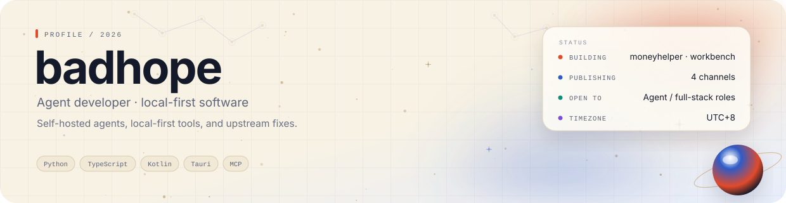
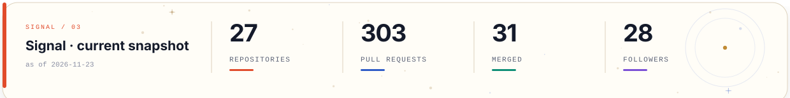

<b>English</b> · <a href="README.zh-CN.md">中文</a> · <a href="README.ja.md">日本語</a>

<picture><source media="(prefers-color-scheme: dark)" srcset="assets/hero-en-dark.svg" /></picture>

<picture><source media="(prefers-color-scheme: dark)" srcset="assets/starchart-en-dark.svg" /></picture>

A slow sky · one turn every three minutes

## 01 · Now

- **Personal repositories** — 27 · personal namespace, forks excluded
- **Upstream pull requests** — 6 selected: 3 merged, 3 open, 0 closed
- **Publishing** — CSDN long-form and Juejin notes; two channels only

## 02 · Upstream pull requests

6 selected · 3 merged · 3 open · 0 closed · +757/−67 · 39 files · 8 comments

- [mogenius/renovate-operator#796](https://github.com/mogenius/renovate-operator/pull/796) — feat(webhook): rotate the webhook auth token via an annotation · **open** · opened 2026-11-05 · +417/−23 · 14 files · 2 comments
- [ncepu-iDealStudio/Fast-Https#9](https://github.com/ncepu-iDealStudio/Fast-Https/pull/9) — fix: 三个深层问题——代理请求帧描述（走私）、两处限流失效、flaky 测试 · **merged** · merged 2026-11-07 · +162/−36 · 11 files · 1 comment
- [evilmartians/lefthook#1629](https://github.com/evilmartians/lefthook/pull/1629) — fix: apply the staged-files fallback to pre-merge-commit · **open** · opened 2026-11-05 · +63/−2 · 5 files · 1 comment
- [sqlfluff/sqlfluff#9009](https://github.com/sqlfluff/sqlfluff/pull/9009) — Snowflake: parse an empty PACKAGES list · **merged** · merged 2026-11-05 · +56/−2 · 3 files · 1 comment
- [mogenius/renovate-operator#772](https://github.com/mogenius/renovate-operator/pull/772) — feat(ui): add a check-all toggle to the log level filter · **merged** · merged 2026-10-31 · +44/−0 · 3 files · 0 comments
- [betterleaks/betterleaks#456](https://github.com/betterleaks/betterleaks/pull/456) — fix(generic-api-key): detect base64 secrets that start with + or / · **open** · opened 2026-11-05 · +15/−4 · 3 files · 3 comments

PR snapshot 2026-11-22 · GitHub Search / pulls API

## 03 · Other projects

| Project | Stack | Scope |
|---|---|---|
| [harbor](https://github.com/badhope/harbor) | Python | self-hosted publishing hub; one draft, 15 channels |
| [spark](https://github.com/badhope/spark) | Python · React | self-hosted coding-agent harness; sandboxed runs, MCP tools |
| [moneyhelper](https://github.com/badhope/moneyhelper) | FastAPI · LangGraph · React | chat-first finance agent; bookkeeping, portfolio risk, filings |
| [workbench](https://github.com/badhope/workbench) | Tauri 2 · React 19 · TypeScript | desktop workbench; clipboard, snippets, windows, quick launch |
| [world-walker](https://github.com/badhope/world-walker) | Python stdlib · MCP | deterministic rules layer for AI interactive fiction |
| [digilegacy](https://github.com/badhope/digilegacy) | Rust | self-hosted digital legacy planning; assets, heirs, release rules |
| [sciflow](https://github.com/badhope/sciflow) | Python · TypeScript | research workbench; literature, experiment log, drafting |
| [aquapilot](https://github.com/badhope/aquapilot) | TypeScript | wastewater process simulation; editable flowsheet, ASM1 |

## 04 · Numbers

<picture><source media="(prefers-color-scheme: dark)" srcset="assets/numbers-en-dark.svg" /></picture>

## 05 · Publishing line

<a href="https://blog.csdn.net/weixin_56622231"><picture><source media="(prefers-color-scheme: dark)" srcset="assets/channel-csdn-en-dark.svg" /></picture></a> <a href="https://juejin.cn/user/2350111542479753"><picture><source media="(prefers-color-scheme: dark)" srcset="assets/channel-juejin-en-dark.svg" /></picture></a>

- 2026-11-04 — [把 AI Agent 接进业务系统，我踩了 3 个挺蠢的坑](https://blog.csdn.net/weixin_56622231/article/details/170051167)
- 2026-10-18 — [Gemini 4 Argon 全面开放：谷歌憋了半年的旗舰大招，到底行不行？](https://blog.csdn.net/weixin_56622231/article/details/168251657)

<a href="https://blog.csdn.net/weixin_56622231">All posts on CSDN →</a>

One source, five profiles · numbers from a local snapshot

All public repositories: [github.com/badhope](https://github.com/badhope)
